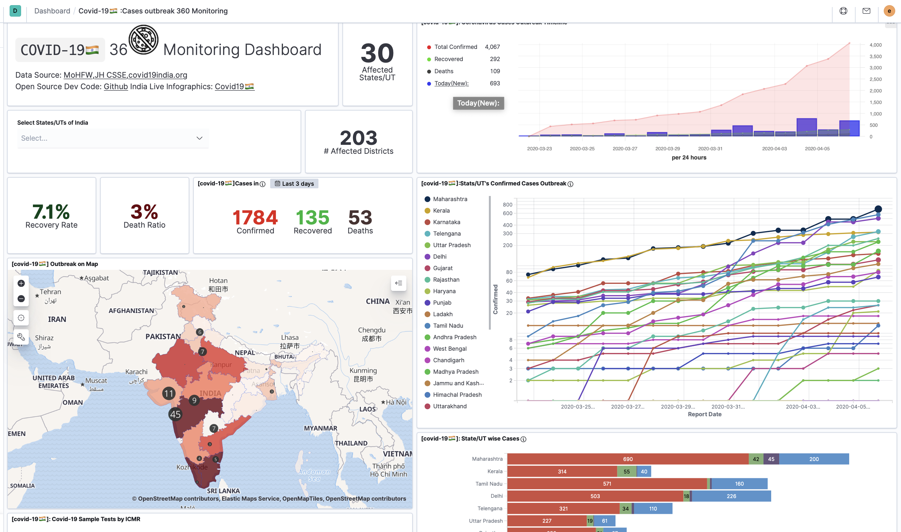

# Novel Coronavirus(Covid-19) India Outbreak Monitoring Dashbaord

<a href="bit.ly/covid19-360">

> An intractive dashboard combining various source of covid-19 data capturing various **daily outbreak**, **timeseries cases**, daily [ICMR](https://icmr.nic.in/content/covid-19) sample test, **Age** and **gender** distribution of patients,**transmission** category cruched at state and district level to understand coronavirus outbreak and go beyond from daily descriptive data to exploratory and explantory data analysis.

*Purpose* of this dashbaord is to have 360° view of all public available data of covid-19 for india and world.Flexibility to deep drive into past timeline, compare with other countries and states of india to see the pattern in outbreak of pandamic to have own prospective about this pandamic and understand the daily changing pattern to take right precaution, decision and staying safe. 

### Build your own prospective and Data Analysis Kit to understand this wordwide crisis

